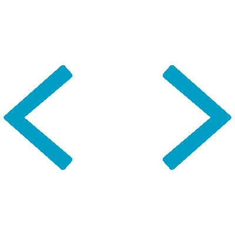

# <b>Hi there, I'm </b><a href="https://github.com/yashsinghal1234">Yash Singhal</a> 👋

### Full Stack Developer • DevOps Enthusiast • AI Explorer

&nbsp;**_About Me_**

  

<table align="center" border="0" cellspacing="0" cellpadding="0">
<tr border="0">

<td border="0">

</td>

<td border="0">

</td>

<td border="0">

</td>

<td border="0">

</td>

<td border="0">

</td>

<td border="0">

</td>

<td border="0">

</td>

<td border="0">

</td>

</tr>
</table>

💻 <b>I'm Yash Singhal</b>, a <b>B.Tech Computer Science student at KIET Ghaziabad</b> passionate about building <b>scalable web applications</b>, <b>AI-powered platforms</b>, and developer-focused tools.

⚡ I primarily work with <b>React</b>, <b>Node.js</b>, <b>Express.js</b>, <b>MongoDB</b>, <b>Java</b>, and <b>Python</b>, transforming ideas into <b>full-stack products</b> with clean UI and efficient backend architecture.

🚀 My interests include <b>Generative AI</b>, <b>Open Source</b>, <b>DevOps</b>, <b>Cloud Technologies</b>, and <b>System Design</b>, where I continuously explore modern technologies and solve real-world problems.

🏗️ I've worked on projects ranging from <b>AI-powered construction management systems</b> to <b>healthcare assistant platforms</b>, while actively participating in <b>hackathons</b>, coding communities, and collaborative development initiatives.

<h3>🎯 Currently Focused On</h3>

<ul>
  <li>⚡ Building impactful <b>Full Stack & AI applications</b></li>
  <li>🚀 Exploring <b>DevOps, Docker, CI/CD & Cloud workflows</b></li>
  <li>🧠 Strengthening <b>DSA and problem-solving skills</b></li>
  <li>🌍 Contributing to <b>Open Source</b> and developer communities</li>
</ul>

✨ I enjoy learning by building, experimenting with emerging technologies, and continuously improving both my development and problem-solving abilities.

 

  

&nbsp;**_Stack I used_**

<table align="center">
    <tr>
        <td align="center" width="90"> Python</td>
        <td align="center" width="90"> JavaScript</td>
        <td align="center" width="90"> TypeScript</td>
        <td align="center" width="90"> Django</td>
        <td align="center" width="90"> Flask</td>
        <td align="center" width="90"> React</td>
        <td align="center" width="90"> Node.js</td>
        <td align="center" width="90"> Express.js</td>
        <td align="center" width="90"> FastAPI</td>
    </tr>
    <tr>
        <td align="center" width="90"> PostgreSQL</td>
        <td align="center" width="90"> Redis</td>
        <td align="center" width="90"> Firebase</td>
        <td align="center" width="90"> Docker</td>
        <td align="center" width="90"> Git</td>
        <td align="center" width="90"> GitHub</td>
        <td align="center" width="90"> GitLab</td>
        <td align="center" width="90"> Cloudflare</td>
        <td align="center" width="90"> Workers</td>
    </tr>
    <tr>
        <td align="center" width="90"> GCP</td>
        <td align="center" width="90"> AWS</td>
        <td align="center" width="90"> Azure</td>
        <td align="center" width="90"> MongoDB</td>
        <td align="center" width="90"> Pages</td>
        <td align="center" width="90"> Postman</td>
        <td align="center" width="90"> Supabase</td>
        <td align="center" width="90"> HTML</td>
        <td align="center" width="90"> CSS</td>
    </tr>
    <tr>
        <td align="center" width="90"> MySQL</td>
        <td align="center" width="90"> SQLite</td>
        <td align="center" width="90"> Obsidian</td>
        <td align="center" width="90"> Vim</td>
        <td align="center" width="90"> VSCodium</td>
        <td align="center" width="90"> Regex</td>
        <td align="center" width="90"> Markdown</td>
        <td align="center" width="90"> C</td>
        <td align="center" width="90"> Debian</td>
    </tr>
</table>

&nbsp; <b>Github Statistics</b>

 

  

<table width="100%">
<tr>

<td align="left" width="50%">

</td>

<td align="right" width="50%">

</td>

</tr>
</table>

  

 
